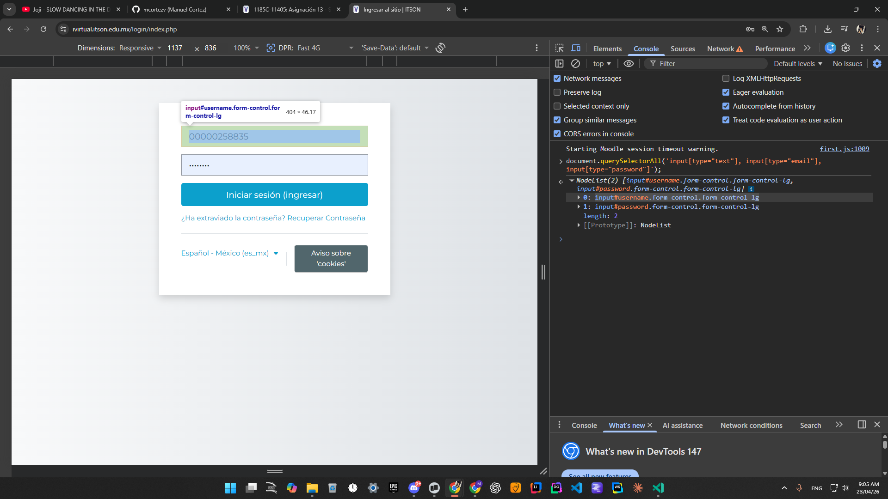
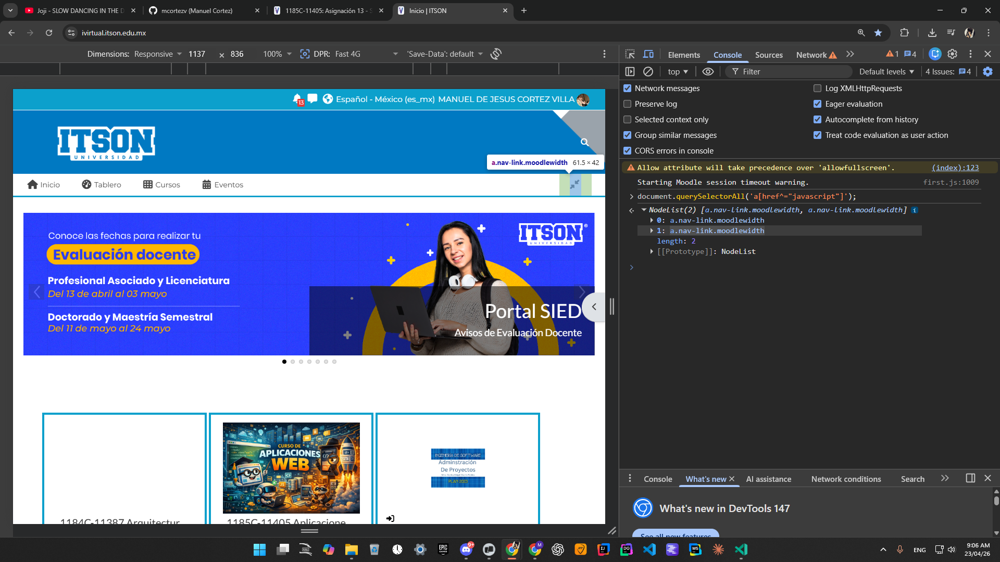
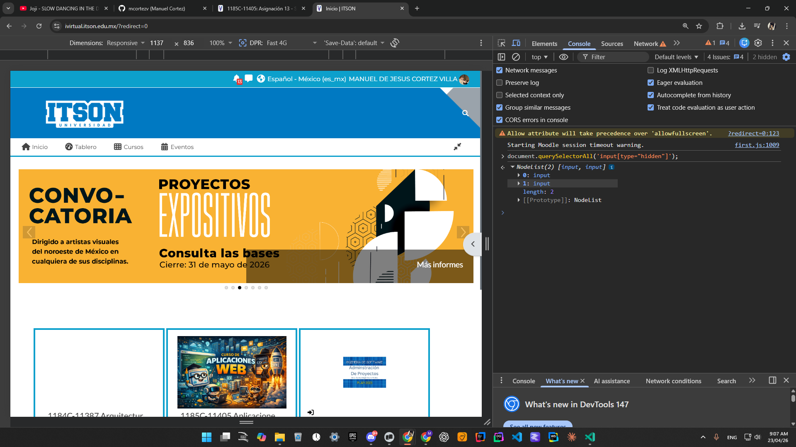
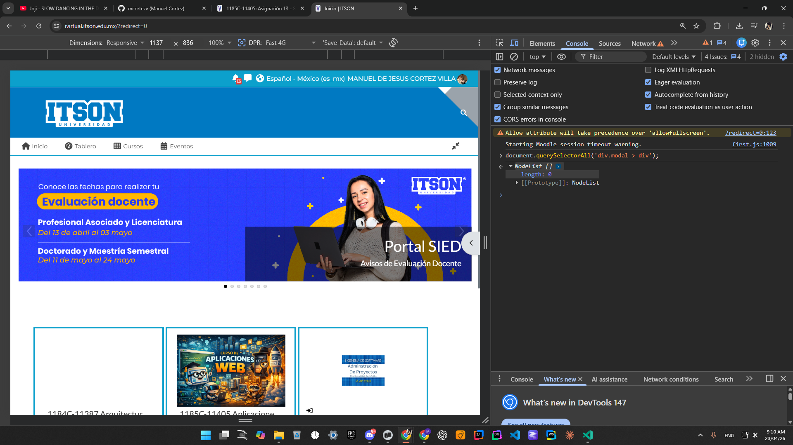
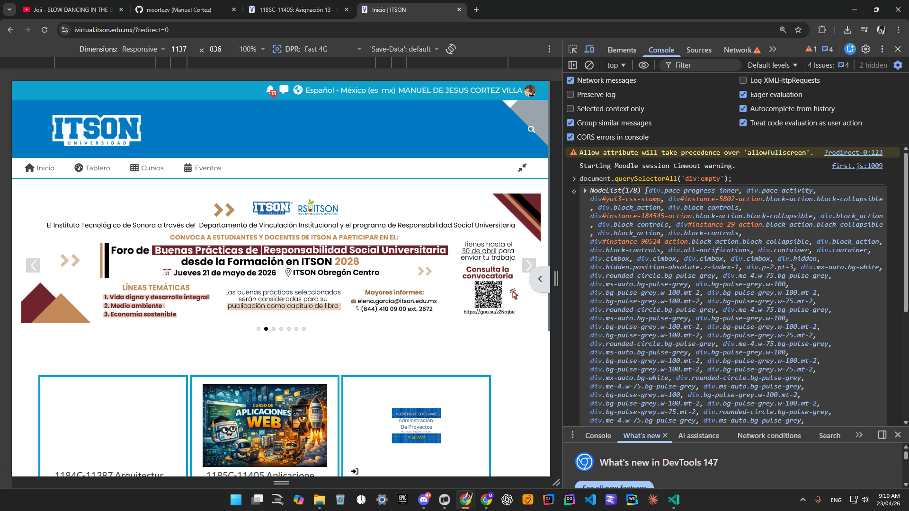
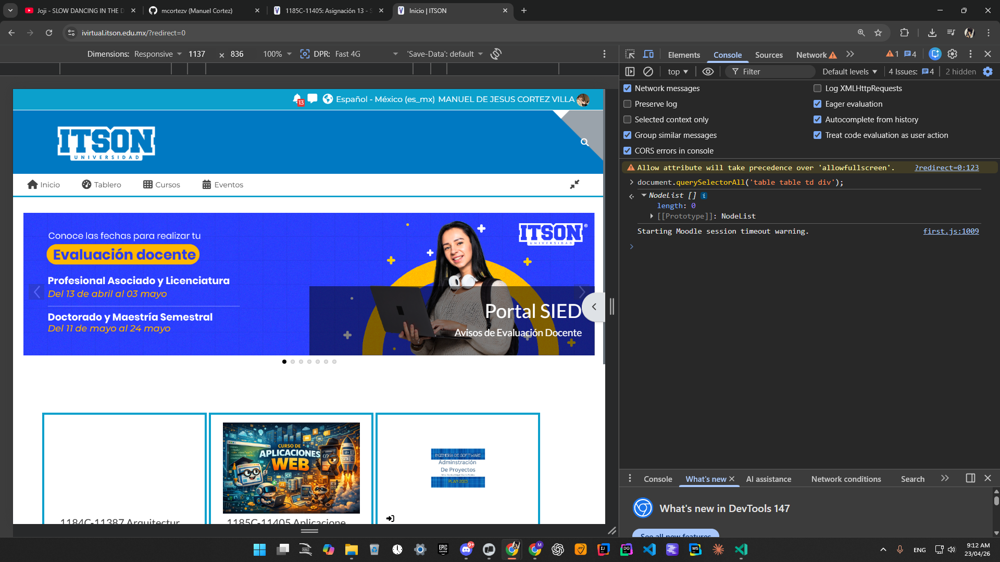
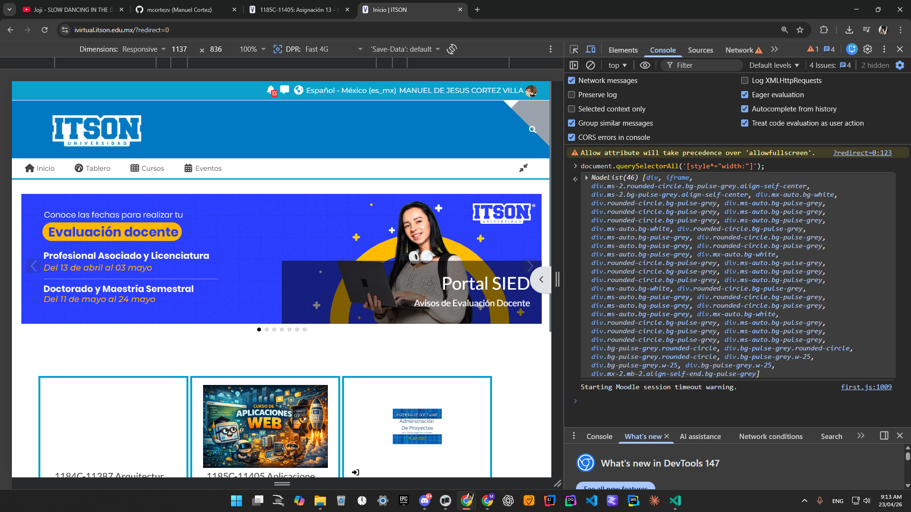

1. Cajas de texto del login

2. Links cuyo href inicia con "javascript"

3. Todos los inputs hidden

4. Divs que son hijos directos de divs con clase "modal"

5. Divs vacíos

6. Divs dentro de celdas de tablas dentro de tablas

7. Elementos cuyo width está en porcentaje

